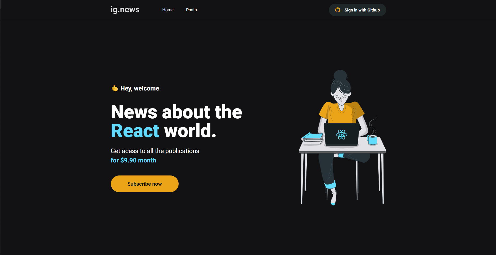

<h1>
  <a href="https://ignews-joao.vercel.app/">
    Ignews
  </a>
</h1>



<h2>Pré-requisitos: </h2>

<ul>
  <li>
    Ter instalado o NodeJS (pode baixar ele neste link: <a href="https://nodejs.org/en/download/">https://nodejs.org/en/download/</a>)
  </li>

  <li>
    (opcional) Instalar o Yarn (guia para instalação do Yarn: <a href="https://yarnpkg.com/getting-started/install">https://yarnpkg.com/getting-started/install</a>)
  </li>
</ul>

<h2>🛠 Técnologias utilizadas:</h2>

<ul>
  <li>HTML</li>
  <li>SASS</li>
  <li>Javascript</li>
  <li>Typescript</li>
  <li>ReactJS</li>
  <li>NextJS</li>
</ul>

```bash
# Clone este repositório
$ git clone <https://github.com/JpRomao/ignews>

# Acesse a pasta do projeto no terminal/cmd
$ cd ignews

# Instale as dependências
$ yarn install (ou npm install)

# Execute a aplicação
$ yarn dev (ou npm run dev)

# A aplicação irá rodar em http://localhost:3000, caso esta porta esteja ocupada, outra porta será escolhida automaticamente
```
